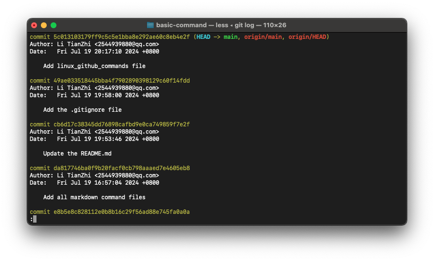

# Github Branch 相关操作

## 查看当前远程仓库分支情况，HEAD指针指向

`$ git branch -a`

## 查看本地分支情况

`$ git branch`

## 删除本地分支

`$ git branch -d localBranchName`

## 删除远程仓库分支
`$ git push origin —delete remoteBranchName`

## 创建本地分支

`$ git branch localBranchName`

## 切换分支

`$ git checkout branchName`

## 分支合并

`$ git merge mergedBranchName`

 
 

# 提交版本撤回，回滚到某次commit

1. `$ git log` 调出日志

2. 选择需要回滚的 commit ID，通过reset命令操作, 例如:  

        $ git reset --hard 05ac0bfb2929d9cbwiener75e52ecb011950fb

3. `--hard` 是强制执行的意思，执行上述命令后，再执行如下命令，强推到远程仓库

        $ git push origin HEAD --force

 
 

# 删除远程仓库文件\文件夹操作

1. 当需要在移除版本控制中的指定文件并需要在工作区中保留该文件时，需要 带 `--cached` 参数

        $ git rm --cached deleteFileName

        $ it rm -r --cached deleteDirctoryName

2. 将删除操作提交到git仓库

        $ git commit -m "delete file remind"

3. 将本次修改更新到github远程仓库

        $ git push origin main

> **注意：** 此删除操作只会删除github远程仓库和git仓库(暂存区和版本库)的文件(夹)，而git仓库的工作区(即本地目录)下的文件(夹)不受影响 

